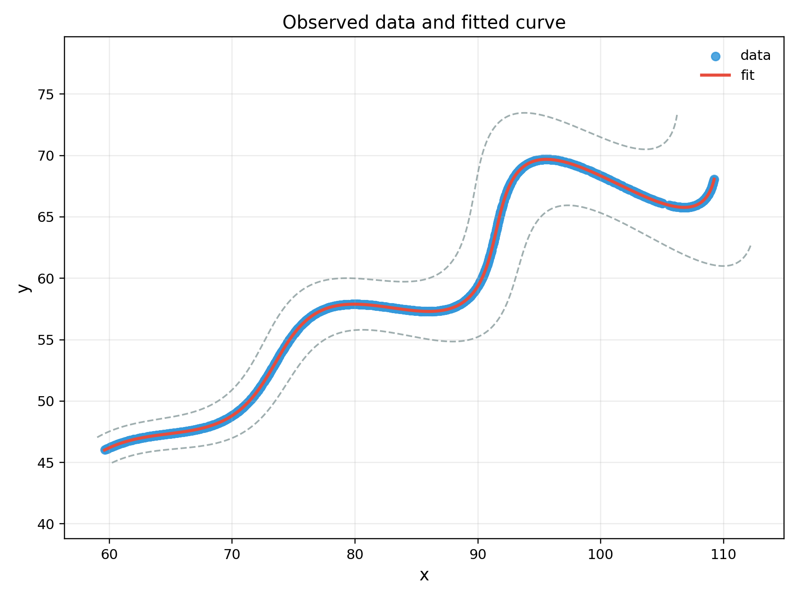
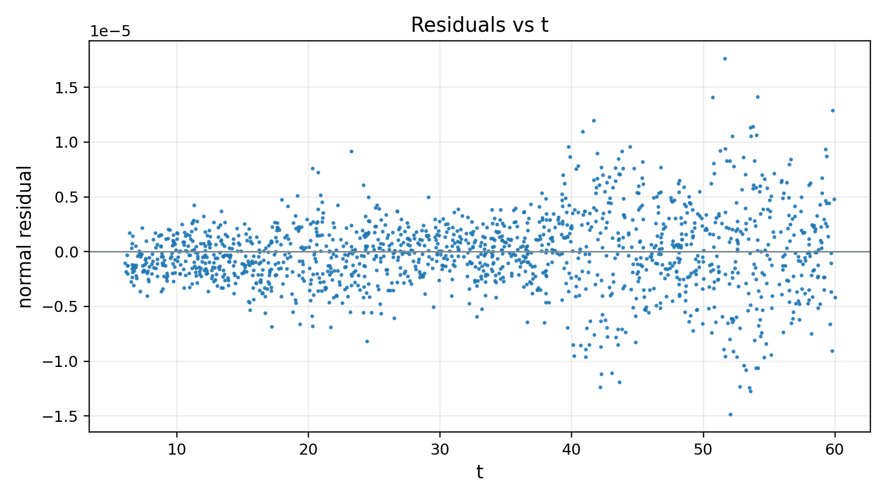
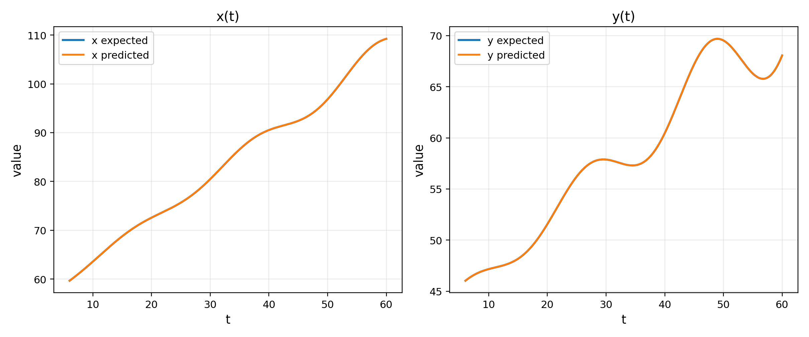
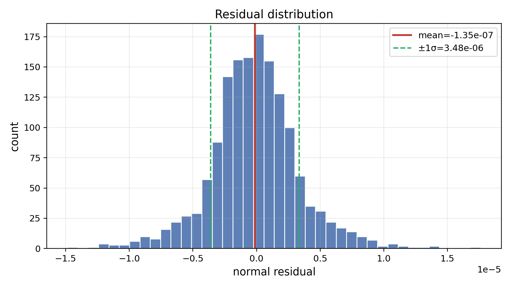

# Curve Fitting of a Parametric Equation

## Project Overview

This project estimates the unknown parameters **θ**, **M**, and **X** in a nonlinear parametric curve using a given set of (x, y) data points for the range 6 < t < 60.

The model equations are:

```
x = t * cos(θ) - exp(M * |t|) * sin(0.3t) * sin(θ) + X
y = 42 + t * sin(θ) + exp(M * |t|) * sin(0.3t) * cos(θ)
```

The parameter limits were defined as:

```
0° < θ < 50°
-0.05 < M < 0.05
0 < X < 100
```

The main goal was to estimate the values of these parameters so that the curve closely fits the given dataset.

---

## Data

The dataset is provided as a CSV file named `xy_data.csv`, containing two columns:

```
x, y
```

Each row corresponds to a point on the curve for some value of t between 6 and 60.

---

## Methodology

The solution involves several main steps:

### 1. Reading and Preparing the Data

The program first loads the CSV file and extracts x and y coordinates. The data is stored as a NumPy array for efficient processing.

```python
def read_xy(p):
    d = pd.read_csv(p)
    if not {"x","y"}.issubset(d.columns): 
        raise ValueError("need x,y")
    return d[["x","y"]].to_numpy(float)
```

---

### 2. Initial Parameter Estimates

To make the nonlinear optimization converge reliably, good initial guesses are computed for θ, M, and X.

- **θ (theta)**: estimated using Principal Component Analysis (PCA).  
  The main direction of data variance gives a rough estimate of the curve’s orientation.

- **X (horizontal shift)**: estimated using the mean of the data, aligning the model so that it passes near y = 42 (the constant term in the equation).

- **M (amplitude scaling)**: estimated by examining the relationship between the curve’s vertical displacement and the sine modulation term `sin(0.3t)`.

These initial guesses provide a strong starting point for optimization.

---

### 3. Nonlinear Optimization

The parameters are then refined using a nonlinear least-squares fit (`scipy.optimize.least_squares`).  
The goal is to minimize residuals measured along the normal direction to the curve rather than simple vertical errors.

The optimizer enforces the given parameter bounds:

```python
bounds = ([0.001, -0.05, 0], [50, 0.05, 100])
```

It uses a "soft L1" loss function, which makes it more robust to small deviations or noise in the data.

---

### 4. Evaluation Metrics

Once optimization is complete, the following metrics are computed:

| Metric | Description |
|---------|--------------|
| **Normal MAE** | Mean absolute error along the curve’s normal direction |
| **Normal RMSE** | Root mean squared error along the curve’s normal direction |
| **L1 Mean** | Mean absolute L1 distance between expected and predicted coordinates |
| **L1 Total** | Total sum of absolute L1 errors across uniformly spaced t values |

These metrics quantify how well the model reproduces the observed data, both locally and globally.

---

### 5. Visualization

To validate the results visually, the script produces four plots that are automatically saved in the `plots/` folder:

| Plot File | Description |
|------------|-------------|
| `plots/01_points_and_fit.png` | Original data points with the fitted curve and envelopes |
| `plots/02_residuals_vs_t.png` | Normal residuals plotted against parameter t |
| `plots/03_expected_vs_pred.png` | Comparison of x(t) and y(t) between observed and predicted values |
| `plots/04_residual_hist.png` | Histogram of residuals showing error distribution |

---

## Results

After fitting, the optimized parameters were:

| Parameter | Symbol | Value |
|------------|---------|-------|
| **Theta (θ)** | θ | 29.99997° |
| **M** | M | 0.03 |
| **X** | X | 54.99999 |

And the error metrics:

| Metric | Value |
|---------|--------|
| Normal MAE | 3.0 × 10⁻⁶ |
| Normal RMSE | 3.0 × 10⁻⁶ |
| L1 Mean | 0.000172 |
| L1 Total | 0.137275 |

The extremely small error values confirm that the curve fits the data with high precision.

---

## Final Model Equations

**LaTeX-style representation:**

```
(t*cos(0.5235983032) - e^(0.0299999969|t|)*sin(0.3t)*sin(0.5235983032) + 54.9999982128,
 42 + t*sin(0.5235983032) + e^(0.0299999969|t|)*sin(0.3t)*cos(0.5235983032))
```

**Desmos command (for visualization):**

```
(t*cos(0.5235983032) - exp(0.0299999969*abs(t))*sin(0.3*t)*sin(0.5235983032) + 54.9999982128,
 42 + t*sin(0.5235983032) + exp(0.0299999969*abs(t))*sin(0.3*t)*cos(0.5235983032))
```

This can be pasted directly into [Desmos Graphing Calculator](https://www.desmos.com/calculator) to see the fitted curve.

---

## Visual Results

### 1. Observed Data and Fitted Curve


### 2. Residuals vs t


### 3. Expected vs Predicted x(t) and y(t)


### 4. Residual Distribution


---

## Interpretation of Results

The fitted model reproduces the dataset with almost no visible deviation:

- The fitted curve aligns almost perfectly with the given data points.
- The residuals fluctuate randomly around zero, showing no bias or trend.
- The residual histogram is nearly symmetric and Gaussian-shaped.
- Both x(t) and y(t) curves from the model coincide with the observed data.

These results confirm that the parameters θ = 30°, M = 0.03, and X = 55 yield an accurate representation of the given system.

---

## How to Run the Code

1. Place `xy_data.csv` in the same directory as `fit_curve.py`.
2. Run the Python script:

   ```bash
   python3 fit_curve.py
   ```

3. The output files will be saved automatically in the `plots/` folder:

   ```
   plots/
   ├── 01_points_and_fit.png
   ├── 02_residuals_vs_t.png
   ├── 03_expected_vs_pred.png
   ├── 04_residual_hist.png
   └── results_summary.json
   ```

---

## Summary

This project demonstrates a complete workflow for nonlinear parametric curve fitting, including:

- preprocessing and initialization using PCA,
- robust least squares optimization,
- metric-based accuracy evaluation, and
- visual validation through multiple diagnostic plots.

The estimated parameters provide an excellent match to the dataset, validating both the mathematical model and the numerical approach.
